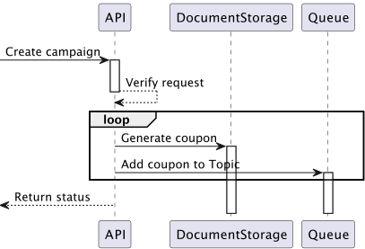
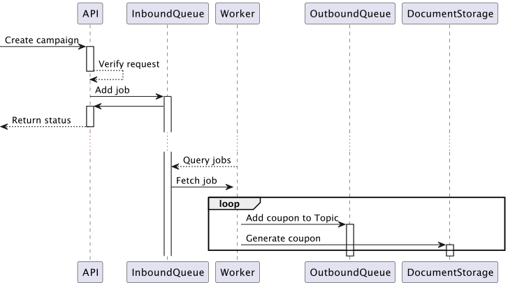
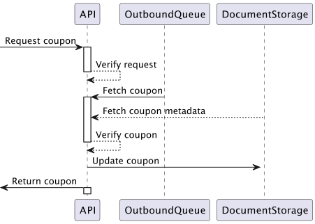

# coupon
A boilerplate for creating a microservice that creates and distributes discount codes.

## Prerequisites
* [Docker](https://www.docker.com/get-started)
* [Curl](https://curl.se/download.html) or [Postman](https://www.postman.com/downloads/)

### Setup
```bash
$ docker-compose up --build -d
$ docker-compose exec php sh
$ composer install
```

### Usage

#### Create campaign
Creates a campaign and generates requested amount of associated coupon codes. The codes are generated in a manner that guarantees that they are unique for this particular campaign.
```bash
$ curl --location --request POST 'http://localhost:8080/topic/foo/123' \
--header 'Content-Type: application/json' \
--header 'Cache-Control: no-cache' \
--form 'campaign_name="foo"' \
--form 'expire_date="202201202"'
```
**Version 1**
The initial (and implemented) idea is that the codes are generated on the fly when a campaign is created.



**Version 2**
The second idea was to speed up response time from the API by simply accepting the creation request and then let a background worker generate the codes.



#### Fetch discount code

The coupons are placed in an outbound queue. This allows us to consume the codes in an ordered manner, and have race-conditions prevented.
```bash
$ curl --location --request GET 'http://localhost:8080/topic/foo' \
--header 'Content-Type: application/json' \
--header 'Cache-Control: no-cache'
```



Tests are done with [phpunit](https://phpunit.de/)
```bash
$ vendor/bin/phpunit tests/
```